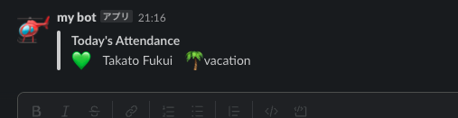

Sample to post about activity and status of channel members to slack channel


```bash
export slack_channel=<slack channel id you want to post>
export slack_token=<slack app bot token>
npm install
npm start
```